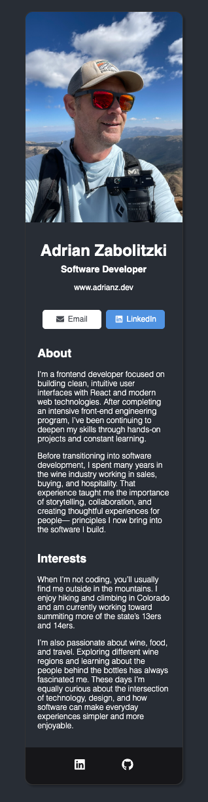

# Digital Business Card

A simple digital business card built with React and Vite.  
The card displays personal information, contact links, and social profiles in a clean UI layout.

## Live Demo

https://adrianz-dev-card.netlify.app

## About

This project was created as part of the Scrimba React course and customized with additional styling and component structure.

## Features

- Modular React component structure
- Email and LinkedIn contact buttons
- Clean card-based layout
- Styled with CSS

## Tech Stack

- React
- Vite
- CSS
- React Icons

## Getting Started

Install dependencies:

npm install

Run the development server:

npm run dev

Build the project:

npm run build
